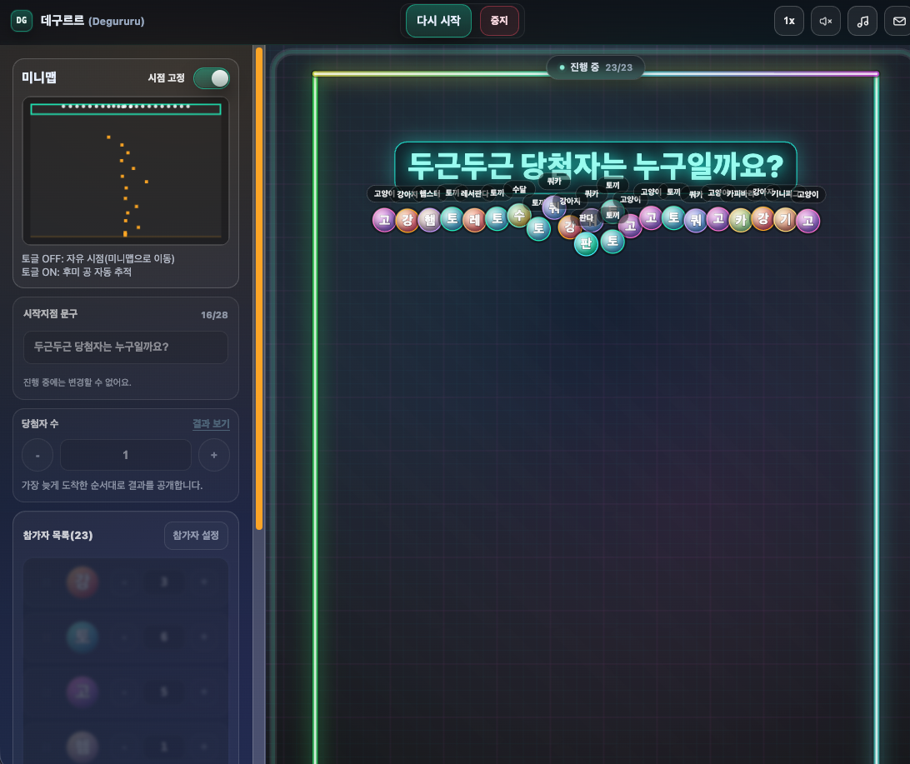
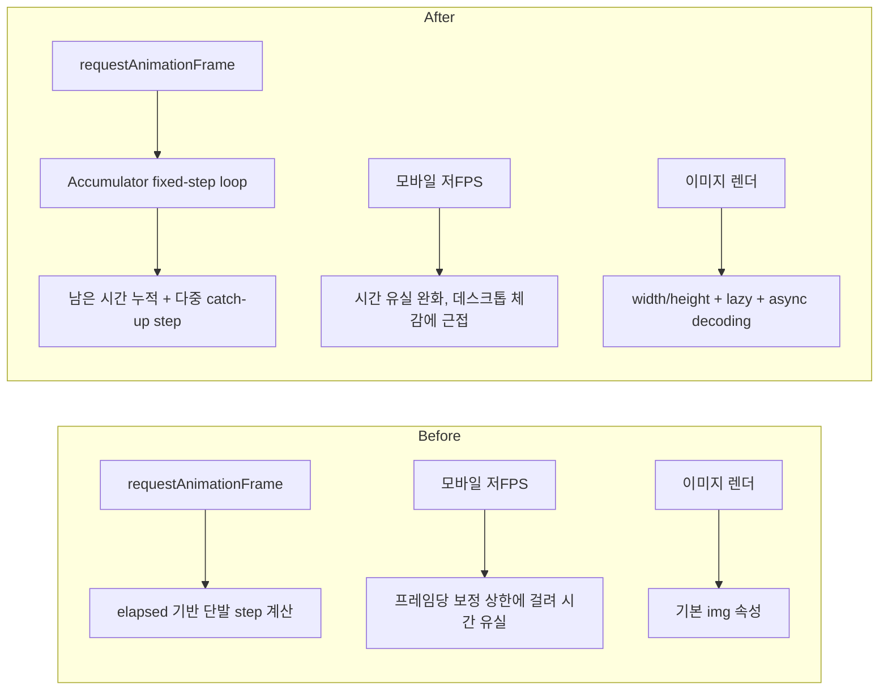
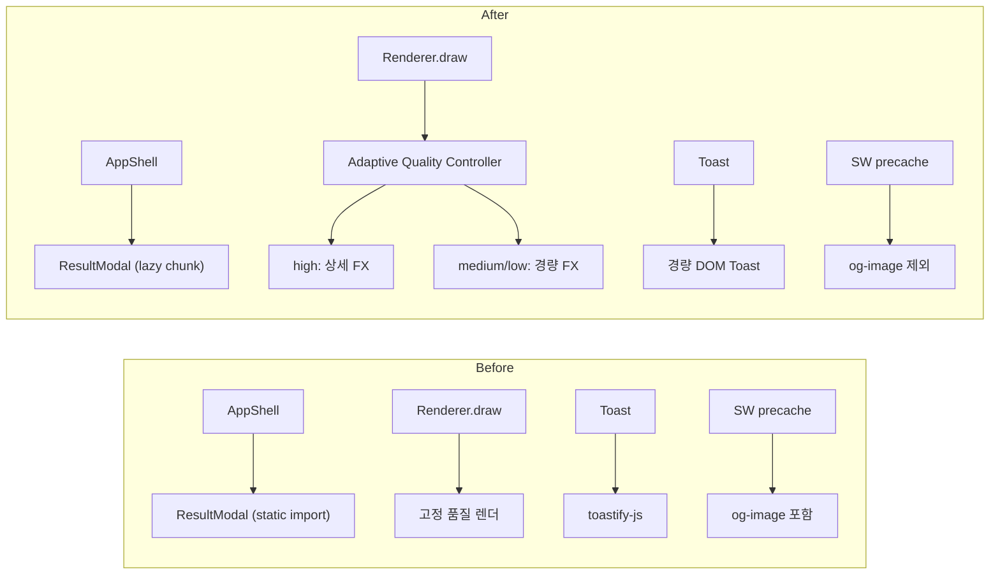

# 데구르르 (Degururu)

데구르르는 공이 떨어지며 당첨자를 정하는 핀볼 사다리 게임입니다. 커피 내기, 점심 메뉴 정하기부터 모임과 이벤트까지 가볍고 재미있게 활용해 보세요!

- 플레이: [https://degururu.vercel.app/](https://degururu.vercel.app/)

## 게임 한눈에 보기



## How To Play

1. 참가자 목록에서 인원/개수를 조정합니다.
2. `참가자 설정`에서 이름, 이미지, 순서를 편집합니다.
3. `게임 시작`으로 전체 공을 동시에 투하합니다.
4. 완료 후 `결과 보기`에서 선택 결과를 확인/복사합니다.

## 성능 최적화

<details>
<summary>2026-02</summary>

목표:
- 모바일에서 공 밀집 구간 버벅임 완화
- 모바일에서 체감 속도 저하(느린 정속) 해소
- 네온/배경 아이덴티티는 유지

아키텍처 변화:



적용 항목:
- 참가자/결과 이미지에 `width/height`, `loading`, `decoding` 힌트 적용
- 루프 컨트롤러를 누적형 고정 스텝(Accumulator)으로 변경
- 모바일 환경의 catch-up 예산을 확대해 실제 기기에서 시간 지연을 완화
- 네온사인/배경 시각 효과는 기존 스타일 유지

최근 빌드 결과(`npm run build:vite`):
- `assets/index-*.js`: 331.39 kB (gzip 105.35 kB)
- `assets/index-*.css`: 64.63 kB (gzip 12.97 kB)

검증:
- `npm run typecheck`
- `npm run lint`
- `npm test`
- `npm run build:vite`
- `npm run security`

</details>

## 성능 최적화 리포트 (2026-02)

목표:
- 모바일에서 공 밀집 구간 버벅임 완화
- 초기 로드 비용 감소 및 UI 안정성 개선
- 물리/당첨 로직은 유지

아키텍처 변화:



적용 항목:
- 렌더러 적응형 품질 제어: 프레임 시간/활성 공 수 기반 자동 강등/복구
- 중간/저품질에서 레일 네온 효과 경량화
- 결과 모달 지연 로딩(`React.lazy + Suspense`)
- 참가자/결과 이미지에 `width/height`, `loading`, `decoding` 힌트 적용
- 토스트 시스템 경량화(라이브러리 의존 없는 DOM 토스트)
- 모바일 `backdrop-filter` 비용 완화
- 서비스워커 precache 축소(OG 이미지 제외)

최근 빌드 결과(`npm run build:vite`):
- `assets/index-*.js`: 126.27 kB (gzip 41.85 kB)
- `assets/vendor-*.js`: 192.39 kB (gzip 60.25 kB)
- `assets/result-modal-*.js`: 8.11 kB (gzip 2.84 kB, 지연 로드)
- `assets/index-*.css`: 64.35 kB (gzip 12.78 kB)

검증:
- `npm run typecheck`
- `npm run lint`
- `npm test`
- `npm run build:vite`
- `npm run security`

## Quick Start

요구사항:
- Node.js 20+

실행:

```bash
npm ci
npm run dev
```

브라우저: `http://localhost:5173`

## 문의 API 환경변수 (선택)

문의하기 기능을 사용할 경우 설정합니다.

```bash
cp .env.example .env.local
```

필수 값:
- `INQUIRY_TO_EMAIL`
- `RESEND_API_KEY`
- `INQUIRY_FROM_EMAIL`
- `INQUIRY_ALLOWED_ORIGINS`

## 품질 검증

```bash
npm run typecheck
npm run lint
npm test --silent
npm run build:vite
```

## 배포 (Vercel)

```bash
vercel deploy -y
vercel deploy --prod -y
```

배포 전 체크:
- `/api/inquiry` 응답 코드(성공/에러) 확인
- 클라이언트 네트워크 탭에 API 키/수신 이메일 노출 없음 확인
- 운영 도메인만 `INQUIRY_ALLOWED_ORIGINS`에 등록

## 프로젝트 구조

```text
src/game        # 물리/시뮬레이션/렌더 로직
src/app         # 앱 상태 결합, 액션, selector
src/ui-react    # React UI 레이어
src/ui          # 비 React 유틸/컨트롤러
api             # 서버리스 API
docs            # 디자인 시스템/문서
```

## 문서

- 디자인 시스템: `docs/design-system.md`
- 개인정보 처리방침: `public/privacy-policy.html`

## 기여 가이드

- PR 제목 형식: `type: summary` (예: `feat: 결과 모달 공개 플로우 개선`)
- 허용 타입: `feat`, `fix`, `refactor`, `chore`, `docs`, `test`, `ci`, `ui`
- PR 본문 섹션 순서:
  - `## 변경 사항`
  - `## 검증`

## 라이선스

별도 라이선스 정책이 필요하면 프로젝트 정책에 맞춰 추가하세요.
